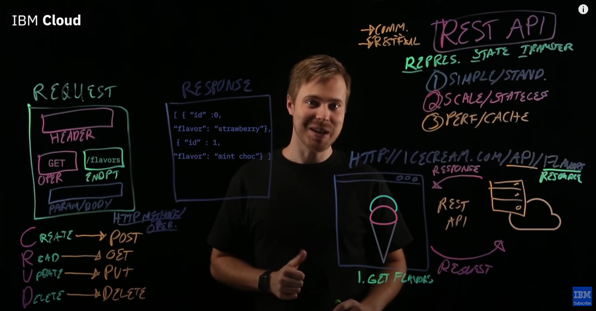
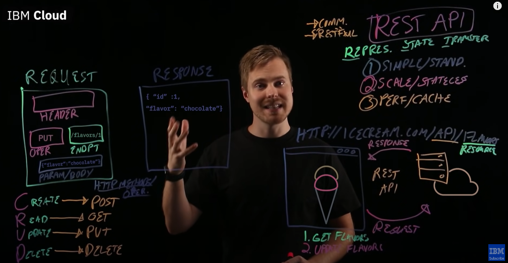
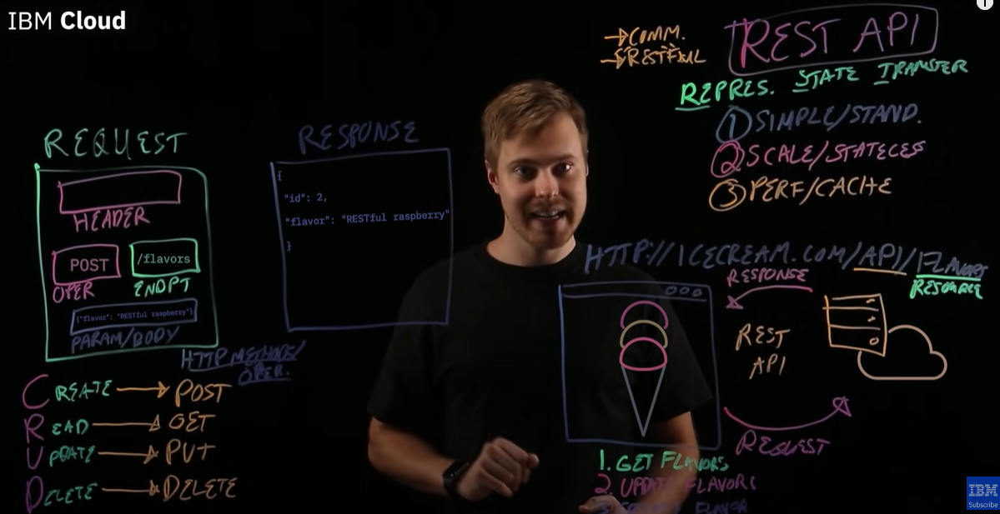

# RESTful web API design

REST is independent of any underlying protocol and is not necessarily tied to HTTP. However, most common REST API implementations use HTTP as the application protocol, and this guide focuses on designing REST APIs for HTTP. REST is an architectural style for building distributed systems based on hypermedia. 

A primary advantage of REST over HTTP is that it uses open standards, and does not bind the implementation of the API or the client applications to any specific implementation.

- REST APIs are designed around resources, which are any kind of object, data, or service that can be accessed by the client.
- A resource has an identifier, which is a URI that uniquely identifies that resource. For example, the URI for a particular customer order might be: https://adventure-works.com/orders/1
- Clients interact with a service by exchanging representations of resources. Many web APIs use JSON as the exchange format. For example, a GET request to the URI listed above might return this response body: {"orderId":1,"orderValue":99.90,"productId":1,"quantity":1}
- REST APIs use a uniform interface, which helps to decouple the client and service implementations. The most common operations are GET, POST, PUT, PATCH, and DELETE.
- REST APIs use a stateless request model. The only place where information is stored is in the resources themselves, and each request should be an atomic operation. This constraint enables web services to be highly scalable, because there is no need to retain any affinity between clients and specific servers. 
- REST APIs are driven by hypermedia links that are contained in the representation. For example, the following shows a JSON representation of an order. It contains links to get or update the customer associated with the order. 

```
{
  "orderID":3,
  "productID":2,
  "quantity":4,
  "orderValue":16.60,
  "links": [
    {"rel":"product","href":"https://adventure-works.com/customers/3", "action":"GET" },
    {"rel":"product","href":"https://adventure-works.com/customers/3", "action":"PUT" }
  ]
}
```
Focus on the business entities that the web API exposes. Creating an order can be achieved by sending an HTTP POST request that contains the order information. A client should not be exposed to the internal implementation.

## In depth process theory information:

Sending an HTTP GET request to the collection URI retrieves a list of items in the collection. Each item in the collection also has its own unique URI. An HTTP GET request to the item's URI returns the details of that item. Hint: Adopt a consistent naming convention in URIs. In general, it helps to use plural nouns for URIs that reference collections. For example, /customers is the path to the customers collection, and `/customers/{id}`  /customers/5 is the path to the customer with an ID equal to 5. Also consider the relationships between different types of resources and how you might expose these associations. For example, the `/customers/5/orders` might represent all of the orders for customer 5.

Try to avoid [chatty](https://learn.microsoft.com/en-us/azure/architecture/antipatterns/chatty-io/) web APIs that expose a large number of small resources. Instead, you might want to denormalize the data and combine related information into bigger resources that can be retrieved with a single request.  

Avoid introducing dependencies between the web API and the underlying data sources. For example, if your data is stored in a relational database, the web API doesn't need to expose each table as a collection of resources.

## API operations in terms of HTTP methods

REST API plays a role in communication between web page and server, benefits are simple, scalable/stateless mean not to worry about data format and high performance as it has cache.
We can request a server through an API from web to server and we get responses from the server. We can do CRUD operations (create, read, update and delete) to communicate. In REST HTTP method equivalent to CRUD are POST, GET, PUT, and DELETE.

The common HTTP methods used by most RESTful web APIs are:

- GET retrieves a representation of the resource at the specified URI. 
- POST creates a new resource at the specified URI. The body of the request message provides the details of the new resource. 
- PUT either creates or replaces the resource at the specified URI. 
- PATCH performs a partial update of a resource. 
- DELETE removes the resource at the specified URI.

The following table summarizes the common conventions adopted by most RESTful implementations using the e-commerce example.

| Resource             | POST                        | GET                               | PUT                                       | DELETE                    |
|----------------------|-----------------------------|-----------------------------------|-------------------------------------------|---------------------------|
| `/customers`         | Create a new customer       | Retrieve all customers            | Bulk update of customers                  | Remove all customers      |
| `/customers/1`       | Error                       | Retrieve the details for customer 1 | Update the details of customer 1 if it exists | Remove customer 1         |
| `/customers/1/orders`| Create a new order for customer 1 | Retrieve all orders for customer 1 | Bulk update of orders for customer 1     | Remove all orders for customer 1 |

Exposing a collection of resources through a single URI can lead to applications fetching large amounts of data when only a subset of the information is required.  Instead, the API can allow passing a filter in the query string of the URI, such as /orders?minCost=n. The web API is then responsible for parsing and handling the minCost parameter in the query string and returning the filtered results on the server side. 

For **GET** it will look like below: get a flavors



For **PUT** it will look like below:  update a flavors



For **POST** it will look like below:  create a flavors



Also, consider implementing HTTP HEAD requests for these resources. A HEAD request is similar to a GET request, except that it only returns the HTTP headers that describe the resource, with an empty message body. A client application can issue a HEAD request to determine whether to fetch a resource by using partial GET requests. For example:
```
HEAD https://adventure-works.com/products/10?fields=productImage HTTP/1.1
```
Here is an example response message:
```
HTTP/1.1 200 OK
Accept-Ranges: bytes
Content-Type: image/jpeg
Content-Length: 4580
```
One of the primary motivations behind REST is that it should be possible to navigate the entire set of resources without requiring prior knowledge of the URI scheme. Each HTTP GET request should return the information necessary to find the resource. This principle is known as HATEOAS, or Hypertext as the Engine of Application State.